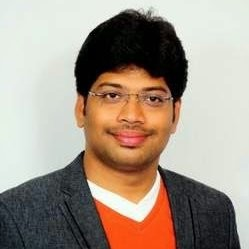
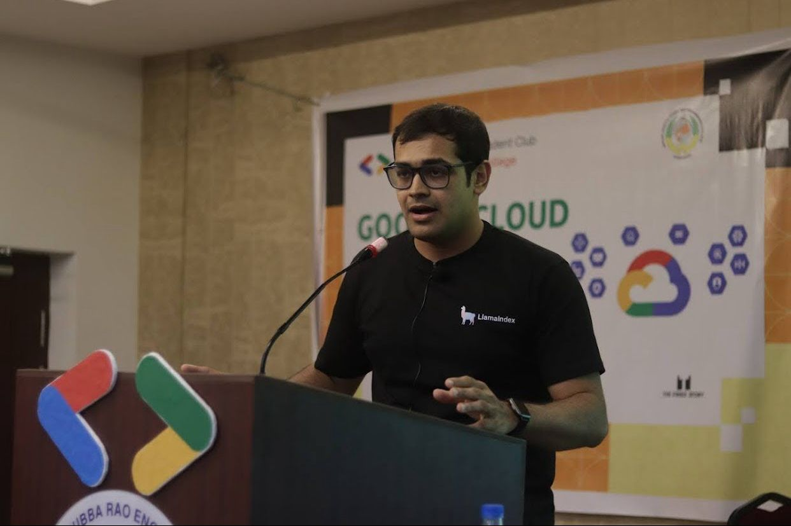

# Schedule

| Start Time | End Time | Duration | Speaker               | Description        |
| ---------- | -------- | -------- | --------------------- | ------------------ |
| 10:00      | 10:45    | 45 mins  | Deep Chenna           | Keynote #1 (Web3)  |
| 10:50      | 11:25    | 35 mins  | Om Ashish Mishra      | Gen AI #1          |
| 11:30      | 12:05    | 35 mins  | Saiteja Alampally     | VR                 |
| 12:10      | 12:45    | 35 mins  | Thulasiram Peddiboina | Web3 #2            |
| 12:45      | 01:15    | 30 mins  |                       | Lunch              |
| 01:15      | 01:30    | 15 mins  |                       | Lunch Buffer       |
| 01:30      | 02:05    | 35 mins  | Gopal Akshintala      | Automation         |
| 02:10      | 02:45    | 35 mins  | Speaker               | Gen AI #2          |
| 02:50      | 03:25    | 35 mins  | Harish Kotra          | Usage of ML        |
| 03:30      | 03:45    | 15 mins  |                       | Generic QnA        |
| 03:45      | 04:00    | 15 mins  |                       | Photos and Wind up |

# Speakers Info

## 1. Deep Chenna (Googler for Web3 Keynote)

[LinkedIn](https://www.linkedin.com/in/deepchenna) | [Email]() | [Phone Number]()

**_Title - Yet to Finalize_**

Yet to get

## 2. Thulasiram Peddiboina (Web 3)

[LinkedIn](https://www.linkedin.com/in/thulasiram-peddiboina) | [Email]() | [Phone Number]()

**_Title - Yet to Finalize_**

Yet to get

## 3. Kalyan Prasad

[LinkedIn](https://www.linkedin.com/in/kalyan-prasad-3a647b22) | [Email]() | [Phone Number]()

**_Title - The art and science of Large language models- A practical walkthrough_**

Kalyan, a self taught data scientist, analytics manager, and open source enthusiast, has graced prestigious stages worldwide with his talks. He’s also a valued mentor and reviewer for renowned edtech organisations, conferences and hackathons, and actively contributes to the growth of open source communities.

## 4. Saiteja Alampally (VR)

[LinkedIn](https://www.linkedin.com/in/saiteja-alampally) | [Email](mailto:Saiteja@oneimmersive.us) | [Phone Number](tel:+917660880889)

**_Title - Creating world scale location based immersive AR experiences using Google's Geospatial creator_**

Saiteja Alampally, with a deep commitment to democratizing Immersive Technologies has founded One Immersive Inc, a spatial technology company.

With 6+ years of experience in XR research and application development, Saiteja passionately advocates for VR/AR/MR at global forums. He mastered designing immersive experiences that can create true presence.

Beyond technology, Saiteja bridges XR and education, taking it to public schools and remote areas.

## 5. Harish Kotra (Low Code No Code)

[LinkedIn](https://www.linkedin.com/in/harishkotra/) | [Email](mailto:harish@fests.info) | [Phone Number](tel:+919618035273)

**_Title - Low Code No Code_**

Yet to get

## 6. Gopal Akshintala

[LinkedIn](https://www.linkedin.com/in/gopal-s-akshintala) | [Email](mailto:gopalakshintala@gmail.com) | [Phone Number](tel:+919483994883)

**_Title - Revolutionize API automation with ReṼoman_**

Yet to get

## 7. Om Ashish Mishra

[LinkedIn](https://www.linkedin.com/in/om-ashish-mishra) | [Email](mailto:omashish100@gmail.com) | [Phone Number](tel:+919994479767)

**_Title - World of Prompt engineering and advancements_**

Om boasts a robust background as a Data Scientist with over 3 years at Deloitte. He has enriched his expertise through participation in the MIT Innovation Bootcamp and as a Harvard Golden HPAIR Delegate. Om's professional journey spans roles at HSBC, Hitachi, and Microsoft, complemented by 3 Google Cloud and 6 Microsoft Azure certifications in ML. Founding Self Growth Community - Blissful Energy, Om actively engages as an AI speaker and consultant, alongside volunteering for UNESCO as a socialist.
